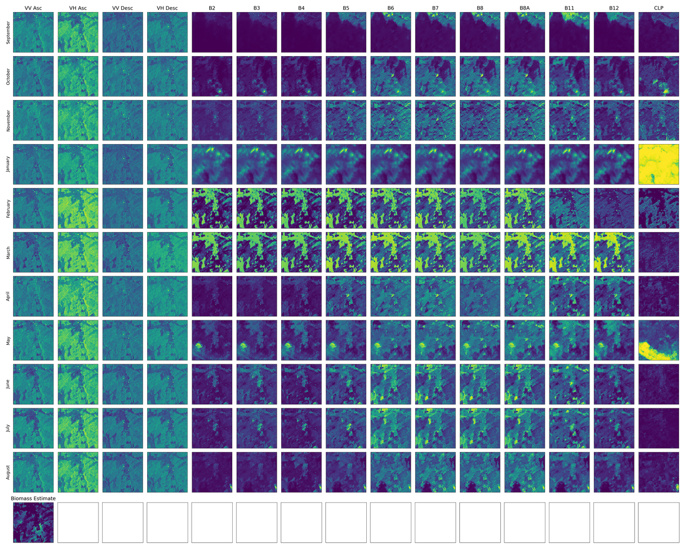

# biomass-estimation

Code for the [Biomass Estimation](https://www.drivendata.org/competitions/99/biomass-estimation/) contest to predict aboveground biomass (AGBM) from time series of Sentinel 1 + 2 imagery.

